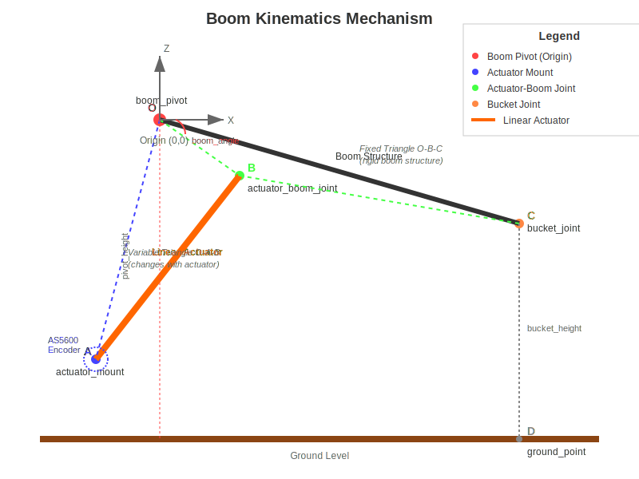

# Boom Kinematics Design Documentation

## Overview

The `BoomKinematics` class implements the kinematic model for a wheel loader boom mechanism controlled by a linear hydraulic actuator. The system uses triangular geometry to convert between actuator positions and boom angles, providing precise control over the boom and bucket position.

## Coordinate System and Geometry

### Visual Representation



### Point Definitions

- **boom_pivot (O)**: Origin of coordinate system, boom rotation axis on vehicle chassis
- **actuator_mount (A)**: Linear actuator mounting point on chassis
- **actuator_boom_joint (B)**: Linear actuator attachment point on boom
- **bucket_joint (C)**: Bucket attachment point at boom tip
- **ground_point (D)**: Ground projection of bucket for height calculations

### Coordinate System

- **Origin**: Located at boom_pivot (O)
- **X-axis**: Horizontal, positive to the right
- **Z-axis**: Vertical, positive upward
- **Angles**: Measured counter-clockwise from positive X-axis

## Geometric Model

### Triangle Relationships

The boom mechanism consists of three key triangular relationships:

#### 1. Variable Triangle: O-A-B (boom_pivot, actuator_mount, actuator_boom_joint)
This triangle changes as the linear actuator extends and retracts:
- **OA**: Fixed distance from pivot to actuator mount (calculated from A_x, A_z coordinates)
- **OB**: Fixed distance from pivot to actuator attachment on boom (`pivot_to_actuator_joint`)
- **AB**: Variable actuator length (controlled by hydraulic system)

#### 2. Fixed Triangle: O-B-C (boom_pivot, actuator_boom_joint, bucket_joint)
This triangle is rigid, welded as part of the boom structure:
- **OB**: Distance from pivot to actuator attachment (`pivot_to_actuator_joint`)
- **OC**: Length of boom (`boom_length`)
- **Angle BOC**: Calculated angle between actuator attachment and boom centerline (`actuator_boom_angle`)

#### 3. Ground Reference: O-C-D (boom_pivot, bucket_joint, ground_point)
Used for bucket height and reach calculations:
- **OC**: Length of boom (`boom_length`)
- **OD**: Height of pivot from ground (`pivot_height_from_ground`)
- **CD**: Calculated bucket height from ground

## Kinematic Chain

### Forward Kinematics (Sensor → Position)

1. **AS5600 Encoder Reading**: Measures rotation angle of actuator cylinder around point A
2. **Actuator Length Calculation**: Convert encoder angle to actuator extension using calibration
3. **Triangle Solution**: Use law of cosines to solve triangle O-A-B for angle AOB
4. **Boom Angle Calculation**: Determine angle of line OB from horizontal
5. **Bucket Position**: Calculate final bucket position using boom angle and fixed geometry

### Inverse Kinematics (Command → Actuator)

1. **Desired Boom Angle**: Target angle for boom centerline
2. **Required Actuator Length**: Calculate needed actuator extension using triangle geometry
3. **Encoder Target**: Convert actuator length to AS5600 encoder angle
4. **Motion Control**: Command actuator to achieve target extension

## AS5600 Encoder Integration

### Sensor Measurement

The AS5600 magnetic encoder measures the **rotation angle of the actuator cylinder** around its mounting point (actuator_mount). This is NOT a direct measurement of actuator length, but rather the angular position of the cylinder as it rotates during extension/retraction.

### Key Characteristics

- **Measurement**: Angle of line AB relative to a reference position (typically minimum extension)
- **Range**: 0-360 degrees (or configured subset)
- **Calibration**: Two-point calibration using known minimum and maximum actuator positions
- **Non-linear Relationship**: Due to triangular geometry, equal angle changes don't produce equal length changes

### Calibration Process

1. **Minimum Position**: Move actuator to fully retracted position, record encoder angle
2. **Maximum Position**: Move actuator to fully extended position, record encoder angle
3. **Interpolation**: Linear interpolation between calibration points for intermediate positions

## Mathematical Relationships

### Law of Cosines Applications

For triangle with sides a, b, c and angle C opposite side c:

**Angle Calculation**:
```
cos(C) = (a² + b² - c²) / (2ab)
C = arccos((a² + b² - c²) / (2ab))
```

**Side Calculation**:
```
c² = a² + b² - 2ab·cos(C)
c = sqrt(a² + b² - 2ab·cos(C))
```

### Key Calculations

1. **Actuator Length to Boom Angle**:
   - Solve triangle O-A-B for angle AOB using known sides OA, OB, AB
   - Calculate angle of OB from horizontal using geometry
   - Add fixed angle BOC to get boom centerline angle

2. **Encoder to Actuator Length**:
   - Linear interpolation between calibration points
   - Account for mechanical constraints and limits

3. **Mechanical Advantage**:
   - Calculate force multiplication ratio based on geometry
   - Varies with boom position due to changing moment arms

## Configuration Parameters

### Geometric Parameters

| Parameter | Description | Units |
|-----------|-------------|-------|
| `actuator_mount_x` | X coordinate of actuator mount from pivot | mm |
| `actuator_mount_z` | Z coordinate of actuator mount from pivot | mm |
| `pivot_to_actuator_joint` | Distance from pivot to boom actuator attachment | mm |
| `boom_length` | Length of boom from pivot to bucket joint | mm |
| `actuator_to_bucket_length` | Distance between actuator joint and bucket attachment | mm |
| `actuator_length_at_zero` | Actuator length when boom is at zero angle | mm |
| `actuator_boom_angle` | Calculated angle between actuator and boom centerline | rad |
| `pivot_height_from_ground` | Height of boom pivot from ground level | mm |

### Operational Limits

| Parameter | Description | Units |
|-----------|-------------|-------|
| `actuator_min_length` | Minimum safe actuator extension | mm |
| `actuator_max_length` | Maximum safe actuator extension | mm |
| `boom_angle_min` | Minimum boom angle (lowest position) | rad |
| `boom_angle_max` | Maximum boom angle (highest position) | rad |

### Sensor Calibration

| Parameter | Description | Units |
|-----------|-------------|-------|
| `encoder_angle_at_min` | AS5600 reading at minimum actuator extension | deg |
| `encoder_angle_at_max` | AS5600 reading at maximum actuator extension | deg |

## Safety Considerations

### Mechanical Limits

- **Actuator Stroke Limits**: Prevent hydraulic cylinder damage
- **Boom Angle Limits**: Avoid collision with chassis or ground
- **Triangle Validity**: Ensure geometric constraints are satisfied
- **Rate Limits**: Control maximum speed of boom movement

### Error Handling

- **Sensor Validation**: Check encoder readings for plausibility
- **Configuration Validation**: Verify geometric parameters make physical sense
- **Limit Enforcement**: Soft and hard limits with appropriate responses
- **Fault Detection**: Monitor for mechanical binding or sensor failures

## Usage Examples

### Basic State Query

```cpp
BoomKinematics kinematics(this);
kinematics.update_configuration();

// Get current state from encoder
float encoder_angle = as5600_reader.get_angle();
auto state = kinematics.get_kinematic_state_from_encoder(encoder_angle);

printf("Boom angle: %.2f°, Bucket height: %.1f mm\n",
       math::degrees(state.boom_angle), state.bucket_height);
```

### Position Command

```cpp
// Command boom to 30 degrees
float desired_angle = math::radians(30.0f);
if (kinematics.is_position_valid(desired_angle)) {
    float target_length = kinematics.boom_angle_to_actuator(desired_angle);
    float target_encoder = kinematics.actuator_length_to_encoder(target_length);

    // Send command to motion controller
    actuator_controller.set_target_position(target_encoder);
}
```

### System Validation

```cpp
// Validate configuration on startup
if (!kinematics.validate_configuration()) {
    PX4_ERR("Invalid boom kinematics configuration");
    return false;
}

// Check if current position is safe
auto current_state = kinematics.get_kinematic_state_from_encoder(encoder_reading);
if (!current_state.is_valid) {
    PX4_WARN("Boom position outside safe limits");
    // Implement appropriate safety response
}
```

## Implementation Notes

### Computational Efficiency

- Pre-calculate fixed values during configuration update
- Use lookup tables for frequently accessed trigonometric functions
- Minimize floating-point operations in real-time loops

### Numerical Stability

- Check for valid triangle conditions before law of cosines calculations
- Handle edge cases near mechanical limits
- Use appropriate numerical precision for geometric calculations

### Calibration Procedures

- Implement automated calibration routines for field setup
- Provide manual override capabilities for maintenance
- Store calibration data persistently with validation

## Testing and Validation

### Unit Tests

- Verify mathematical relationships with known test cases
- Test limit checking and validation functions
- Validate encoder conversion accuracy

### Integration Tests

- Test complete kinematic chain from encoder to bucket position
- Verify safety limit enforcement
- Test calibration procedures

### Field Validation

- Compare calculated positions with physical measurements
- Validate mechanical advantage calculations under load
- Verify system behavior across full operating range
