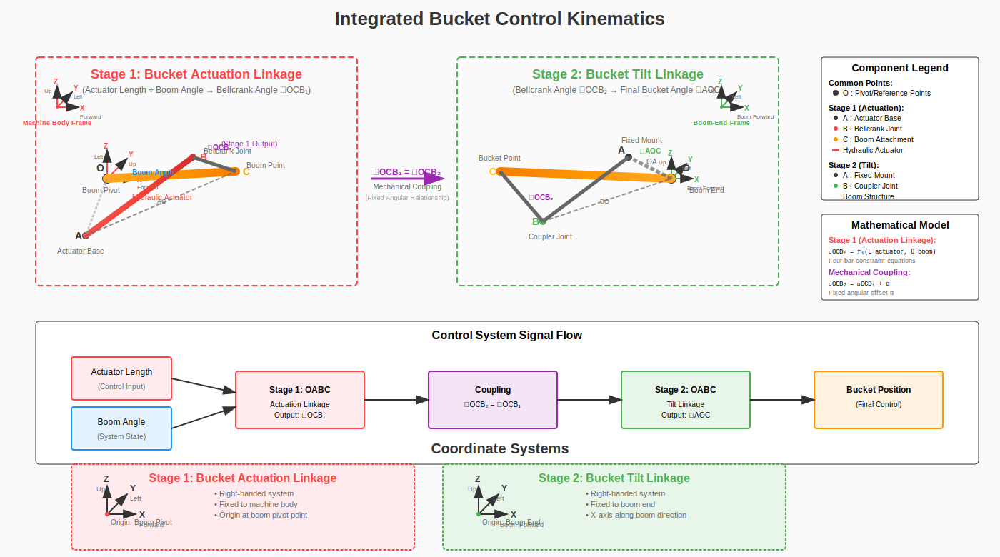

# Bucket Kinematics Design

## Overview

The wheel loader bucket system employs a sophisticated dual-linkage mechanism that provides coordinated boom lift and bucket tilt control through a single linear actuator. This design ensures optimal bucket positioning throughout the entire operating range while maintaining mechanical efficiency.

## System Architecture

The integrated bucket control system employs a two-stage coupled four-bar linkage mechanism:

1. **Stage 1: Bucket Actuation Linkage** - Converts actuator length + boom angle → bellcrank angle ∠OCB₁
2. **Stage 2: Bucket Tilt Linkage** - Converts bellcrank angle ∠OCB₂ → final bucket angle ∠AOC

The stages are mechanically coupled through the relationship: ∠OCB₁ = ∠OCB₂, providing coordinated motion control.

## Mechanism Diagram



*Figure 1: Integrated bucket control kinematics showing two-stage coupled four-bar linkage system. Stage 1 (Bucket Actuation Linkage) converts actuator length and boom angle to bellcrank angle. Stage 2 (Bucket Tilt Linkage) converts bellcrank angle to final bucket angle through mechanical coupling.*

## Detailed Linkage Description

### Stage 1: Bucket Actuation Linkage (OABC)

This is the primary four-bar mechanism that converts linear actuator motion and boom angle into bellcrank angular position:

**Fixed Links:**
- **OA**: Body link connecting boom pivot to actuator base (fixed to machine frame)
- **OC**: Boom attachment span (varies with boom angle)

**Moving Links:**
- **AB**: Hydraulic actuator (variable length - control input)
- **BC**: Bellcrank arm

**Joints:**
- **O**: Boom pivot (revolute, fixed to machine body)
- **A**: Actuator base (revolute, fixed to machine frame)
- **B**: Bellcrank joint (revolute, moving)
- **C**: Boom attachment point (revolute, moves with boom)

**Function:**
- Inputs: Actuator length + boom angle
- Output: Bellcrank angle ∠OCB₁
- Provides mechanical advantage and motion transformation

### Stage 2: Bucket Tilt Linkage (OABC)

This secondary four-bar mechanism converts the bellcrank angle into the final bucket positioning:

**Fixed Links:**
- **OA**: Bucket attachment link (fixed to bucket structure)
- **OC**: Boom structure (extends to bucket point)

**Moving Links:**
- **AB**: Coupler link
- **BC**: Bellcrank (other half part of the bellcrank from Stage 1)

**Joints:**
- **O**: Reference point (coordinate system origin)
- **A**: Bucket attachment point (revolute, fixed to bucket)
- **B**: Coupler joint (revolute, moving)
- **C**: Bucket point (revolute, final output)

**Function:**
- Input: Bellcrank angle ∠OCB₂ (mechanically coupled from Stage 1)
- Output: Final bucket angle ∠AOC
- Provides coordinated bucket positioning throughout boom motion

### Mechanical Coupling

The two stages are mechanically coupled through the constraint:
```
∠OCB₁ = ∠OCB₂ + α
```
where α is a fixed angular offset determined by the mechanical design.

## Coordinate Systems

### Stage 1: Bucket Actuation Linkage Coordinate System
**Reference Frame Definition**:
- **Origin**: Boom pivot point (O)
- **X-axis**: Forward direction (positive pointing toward machine front)
- **Y-axis**: Left direction (positive pointing to machine left side)
- **Z-axis**: Upward direction (positive pointing up from ground)
- **Coordinate Type**: Right-handed coordinate system
- **Fixed to**: Machine body/frame (moves with the wheel loader)

**Physical Meaning**:
- This coordinate system is **fixed to the machine body**
- Origin at the boom pivot allows direct measurement of boom angles
- Standard 3D coordinate system for mobile machinery
- All measurements are relative to the machine's structural frame

### Stage 2: Bucket Tilt Linkage Coordinate System
**Reference Frame Definition**:
- **Origin**: Boom end reference point (O)
- **X-axis**: Longitudinal boom direction (positive pointing along boom forward)
- **Y-axis**: Left direction (positive pointing to boom left side)
- **Z-axis**: Perpendicular to boom plane (completes right-handed system)
- **Coordinate Type**: Right-handed coordinate system
- **Fixed to**: Boom end (moves and rotates with boom motion)

**Physical Meaning**:
- This coordinate system is **attached to the boom end**
- Origin moves with boom tip as boom rotates
- X-axis aligned along boom longitudinal axis for natural reference
- All measurements are relative to the boom end position and orientation

### Coordinate System Relationship
```
Stage 1: Machine body frame (XYZ - forward/left/up)
         ↓ (boom rotation transformation)
Stage 2: Boom-end frame (XYZ - boom-forward/left/perpendicular)
```

**Transformation Between Systems**:
- **Translation**: From machine body origin to boom end
- **Rotation**: By boom angle (θ_boom) about machine Y-axis (left)
- **Axis Alignment**: Stage 2 X-axis follows boom longitudinal direction
- **Coupling**: Both systems use right-handed coordinates
- **Mechanical Coupling**: Linkage maintains angular relationships between stages

## Kinematic Analysis

### Forward Kinematics

Given actuator length and boom angle, compute bucket angle:

1. **Solve Actuation Linkage:**
   - Use four-bar constraint equations to find bellcrank angle
   - Apply Newton-Raphson iteration for joint positions
   - Extract angle OCB from solution

2. **Solve Tilt Linkage:**
   - Apply coupling relationship between bellcrank and bucket
   - Account for boom angle compensation
   - Compute final bucket angle relative to ground

### Inverse Kinematics

Given desired bucket angle and boom angle, compute required actuator length:

1. **Determine Required Bellcrank Angle:**
   - Back-calculate from desired bucket position
   - Apply inverse tilt linkage relationships

2. **Solve Inverse Actuation Linkage:**
   - Use geometric constraints to find required actuator length
   - Validate against mechanical limits

## Design Parameters

### Geometric Parameters

| Parameter | Symbol | Description | Units |
|-----------|---------|-------------|-------|
| Actuator Base X | BCT_ACT_BASE_X | X position of actuator base | mm |
| Actuator Base Y | BCT_ACT_BASE_Y | Y position of actuator base | mm |
| Bellcrank-Boom X | BCT_BCK_BOOM_X | X position of bellcrank-boom joint | mm |
| Bellcrank-Boom Y | BCT_BCK_BOOM_Y | Y position of bellcrank-boom joint | mm |
| Bucket Pivot X | BCT_BKT_PIV_X | X position of bucket pivot | mm |
| Bucket Pivot Y | BCT_BKT_PIV_Y | Y position of bucket pivot | mm |
| Bellcrank Length | BCT_BCK_LEN | Length of bellcrank arm | mm |
| Coupler Length | BCT_COUP_LEN | Length of coupler link | mm |
| Bucket Arm Length | BCT_BKT_ARM_LEN | Length of bucket arm | mm |

### Operational Parameters

| Parameter | Symbol | Description | Units |
|-----------|---------|-------------|-------|
| Actuator Offset | BCT_ACT_OFF | Actuator zero-length offset | mm |
| Bellcrank Internal Angle | BCT_BCK_INT_ANG | Internal angle of bellcrank | rad |
| Bucket Offset | BCT_BKT_OFF | Bucket angle offset | rad |
| Actuator Min Length | BCT_ACT_MIN | Minimum actuator extension | mm |
| Actuator Max Length | BCT_ACT_MAX | Maximum actuator extension | mm |
| Bucket Angle Min | BCT_ANG_MIN | Minimum bucket angle | rad |
| Bucket Angle Max | BCT_ANG_MAX | Maximum bucket angle | rad |

## Mathematical Relationships

### Stage 1: Actuation Linkage Constraints

For the four-bar OABC mechanism in Stage 1:

```
Position constraints:
|OA|² = (xA - xO)² + (yA - yO)²  [Fixed body link]
|AB|² = (xB - xA)² + (yB - yA)²  [Variable - actuator length]
|BC|² = (xC - xB)² + (yC - yB)²  [Fixed - bellcrank length]
|OC|² = (xC - xO)² + (yC - yO)²  [Variable - boom geometry]

Loop closure:
OA + AB + BC + CO = 0  [Vector sum]

Output:
∠OCB₁ = f₁(L_actuator, θ_boom)
```

### Stage 2: Tilt Linkage Constraints

For the four-bar OABC mechanism in Stage 2:

```
Position constraints:
|OA|² = (xA - xO)² + (yA - yO)²  [Fixed bucket attachment link]
|AB|² = (xB - xA)² + (yB - yA)²  [Fixed - coupler length]
|BC|² = (xC - xB)² + (yC - yB)²  [Fixed - bellcrank other half]
|OC|² = (xC - xO)² + (yC - yO)²  [Fixed - boom structure]

Output:
∠AOC = f₂(∠OCB₂)
```

### Mechanical Coupling Relationship

```
Bellcrank coupling:
∠OCB₂ = ∠OCB₁ + α

where α is the fixed angular offset between stages.

Complete system:
∠AOC = f₂(f₁(L_actuator, θ_boom) + α)
```

## Singularity Analysis

The system can encounter singularities when:

1. **Actuation Linkage Singularities:**
   - When points O, B, C become collinear
   - At extreme actuator extensions
   - Poor transmission angles (< 30°)

2. **Tilt Linkage Singularities:**
   - When coupler and bucket arm are aligned
   - At mechanical stops

**Detection Method:**
- Compute condition number based on transmission angles
- Monitor Jacobian matrix rank
- Check for near-zero denominators in calculations

## Implementation Architecture

### Class Structure

```cpp
class BucketKinematics : public ModuleParams
{
    // Core kinematics functions
    LinkageState compute_forward_kinematics(float actuator_length, float boom_angle);
    LinkageState compute_inverse_kinematics(float bucket_angle, float boom_angle);

    // Analysis functions
    matrix::Matrix<float, 2, 2> compute_jacobian(const LinkageState& state);
    float compute_condition_number(const LinkageState& state);

    // Validation
    bool validate_configuration();
    bool check_mechanical_limits(const LinkageState& state);
};
```

## Solution Methods

### Trigonometric Solution Approach

Four-bar linkage problems can be solved analytically using triangle functions, providing faster and more reliable solutions than iterative methods:

#### Method 1: Law of Cosines Approach

For a four-bar linkage OABC with known link lengths, use the triangle formed by the diagonal and two adjacent links:

```
Given: |OA|, |AB|, |BC|, |OC| (link lengths)
Find: Joint angles and positions

Step 1: Form triangle OBC using diagonal |OB|
|OB|² = |OA|² + |AB|² - 2|OA||AB|cos(∠OAB)

Step 2: Apply law of cosines in triangle OBC
cos(∠OCB) = (|OC|² + |BC|² - |OB|²) / (2|OC||BC|)

Step 3: Solve for remaining angles
∠AOC = ∠AOB + ∠BOC
```

#### Method 2: Complex Number Approach

Represent each link as a complex vector and use Euler's formula:

```
Link vectors: z₁ = |OA|e^(iθ₁), z₂ = |AB|e^(iθ₂), etc.
Loop closure: z₁ + z₂ + z₃ + z₄ = 0
Separate real/imaginary parts to solve for angles
```

#### Method 3: Coordinate Geometry

Use direct trigonometric relationships with coordinate projections:

```
For Stage 1 (Actuation Linkage):
1. Known: Actuator length L_act, boom angle θ_boom
2. Calculate joint B position using circle intersections
3. Use atan2() to find angle ∠OCB directly

For Stage 2 (Tilt Linkage):
1. Known: Bellcrank angle ∠OCB from Stage 1
2. Apply geometric constraints of fixed links
3. Calculate final bucket angle ∠AOC analytically
```

### Advantages of Trigonometric Solutions

1. **Computational Efficiency:**
   - O(1) constant time complexity
   - No iteration or convergence issues
   - Deterministic execution time

2. **Numerical Stability:**
   - No accumulation of iteration errors
   - Well-conditioned trigonometric functions
   - Reliable near singularities

3. **Real-time Suitability:**
   - Predictable computation time
   - Suitable for high-frequency control loops
   - Lower CPU overhead

### Implementation Strategy

```cpp
class BucketKinematicsTrig : public ModuleParams
{
    // Analytical trigonometric solutions
    float solve_actuation_angle(float actuator_length, float boom_angle);
    float solve_bucket_angle(float bellcrank_angle);

    // Helper functions
    Vector2f circle_intersection(Vector2f c1, float r1, Vector2f c2, float r2);
    float law_of_cosines_angle(float a, float b, float c);

    // Validation
    bool is_solution_valid(float angle, float min_limit, float max_limit);
};
```

### Solution Algorithm

1. **Newton-Raphson Iteration:**
   - Used for actuation linkage position solving
   - Convergence tolerance: 1e-6
   - Maximum iterations: 50

2. **Geometric Constraints:**
   - Circle-circle intersection for joint positions
   - Law of cosines for angle calculations
   - Sine rule for supplementary angle finding

3. **Numerical Differentiation:**
   - Jacobian computation for sensitivity analysis
   - Finite difference method with adaptive step size

## Performance Characteristics

### Computational Complexity
- **Trigonometric solution**: O(1) constant time
- **Newton-Raphson fallback**: O(n) where n ≤ 50 iterations (for edge cases)
- **Inverse kinematics**: O(1) closed-form solution
- **Jacobian computation**: O(1) analytical differentiation

### Accuracy
- Position accuracy: ±0.1mm
- Angle accuracy: ±0.01 radians
- **Trigonometric precision**: Machine epsilon (no iteration error)

### Real-time Performance
- **Typical solve time**: <10μs (trigonometric solution)
- **Maximum solve time**: <100μs (including validation)
- **Suitable for**: 10kHz+ control loops
- **Deterministic execution**: No iteration variability

## Usage Examples

### Basic Forward Kinematics

```cpp
BucketKinematics kinematics;
LinkageState state = kinematics.compute_forward_kinematics(500.0f, 0.2f);
if (state.is_valid) {
    PX4_INFO("Bucket angle: %.2f rad", (double)state.bucket_angle);
}
```

### Trigonometric Solution Example

```cpp
// Stage 1: Actuation Linkage (OABC)
float solve_actuation_linkage(float actuator_length, float boom_angle) {
    // Known link lengths
    float L_OA = params.BCT_ACT_BASE_DIST;  // Actuator base distance
    float L_AB = actuator_length;           // Variable actuator length
    float L_BC = params.BCT_BCK_LEN;       // Bellcrank length
    float L_OC = calculate_boom_span(boom_angle);  // Boom geometry

    // Method 1: Law of cosines approach
    // Calculate diagonal OB using triangle OAB
    float cos_angle_OAB = calculate_actuator_angle(boom_angle);
    float L_OB_sq = L_OA * L_OA + L_AB * L_AB - 2 * L_OA * L_AB * cos(cos_angle_OAB);
    float L_OB = sqrt(L_OB_sq);

    // Apply law of cosines in triangle OBC
    float cos_OCB = (L_OC * L_OC + L_BC * L_BC - L_OB_sq) / (2 * L_OC * L_BC);
    float angle_OCB = acos(cos_OCB);

    return angle_OCB;
}

// Stage 2: Tilt Linkage (OABC)
float solve_tilt_linkage(float bellcrank_angle) {
    // Known link lengths for Stage 2
    float L_OA = params.BCT_BKT_ARM_LEN;   // Bucket arm length
    float L_AB = params.BCT_COUP_LEN;      // Coupler length
    float L_BC = params.BCT_BCK_LEN;       // Bellcrank length (other half)
    float L_OC = params.BCT_BCK_BOOM_DIST; // Boom structure length

    // Known angle from Stage 1 coupling
    float angle_OCB = bellcrank_angle + params.BCT_BCK_INT_ANG;

    // Use coordinate geometry approach
    Vector2f point_C = {L_OC * cos(0), L_OC * sin(0)};  // Boom direction
    Vector2f point_B = {L_BC * cos(angle_OCB), L_BC * sin(angle_OCB)};

    // Find point A using circle intersections
    Vector2f point_A = circle_intersection(
        {0, 0}, L_OA,           // Circle centered at O with radius OA
        point_B, L_AB           // Circle centered at B with radius AB
    );

    // Calculate final bucket angle
    float bucket_angle = atan2(point_A.y, point_A.x);
    return bucket_angle;
}
```

### Boom Compensation

```cpp
float compensation = kinematics.get_boom_compensation_factor(current_boom_angle);
float required_actuator_change = boom_angle_change * compensation;
```

### Singularity Detection

```cpp
LinkageState state = kinematics.compute_forward_kinematics(actuator_length, boom_angle);
if (state.condition_number > SINGULARITY_THRESHOLD) {
    PX4_WARN("Approaching kinematic singularity");
}
```

## Integration with Control System

The bucket kinematics integrates with the wheel loader control system by:

1. **Providing position feedback** for closed-loop bucket control
2. **Enabling coordinated boom-bucket motion** for optimal digging trajectories
3. **Supporting operator assistance** through automatic bucket leveling
4. **Preventing mechanical damage** through limit checking

## Future Enhancements

1. **Dynamic Analysis:** Include link inertias and dynamic effects
2. **Compliance Modeling:** Account for hydraulic system compliance
3. **Wear Compensation:** Adaptive parameters for joint wear
4. **Multi-Body Dynamics:** Integration with boom dynamics model

---

*This document describes the kinematic design for the wheel loader bucket control system. For implementation details, refer to the source code in `/src/modules/bucket_control/`.*
