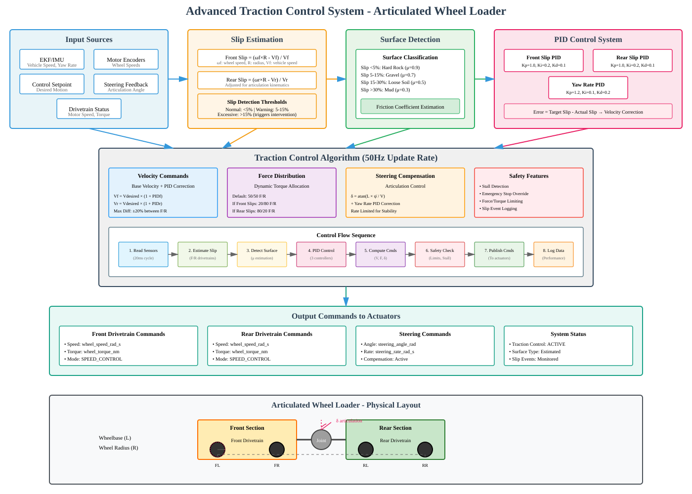

# Advanced Traction Control System for Articulated Wheel Loader

## Overview

This document provides a comprehensive explanation of the advanced traction control system implemented for the articulated wheel loader robot. The system is designed to optimize traction and stability during mining operations on varying terrain conditions.

## System Architecture



## Key Components

### 1. Input Sources

The traction control system receives input from multiple sources:

- **EKF/IMU**: Provides vehicle velocity (vx, vy, vz) and yaw rate from the Extended Kalman Filter
- **Motor Encoders**: Real-time wheel speed measurements from front and rear drivetrain motors
- **Control Setpoints**: Desired motion commands from manual control or autonomous planner
- **Steering Feedback**: Current articulation angle of the vehicle
- **Drivetrain Status**: Motor speed, torque, and health information

### 2. Slip Estimation Algorithm

The system calculates slip for each drivetrain using the following approach:

#### Front Drivetrain Slip Calculation
```
Slip_front = (ω_front × R - V_effective_front) / V_effective_front
```

#### Rear Drivetrain Slip Calculation
```
Slip_rear = (ω_rear × R - V_effective_rear) / V_effective_rear
```

Where:
- `ω`: Wheel angular velocity (rad/s)
- `R`: Wheel radius (m)
- `V_effective`: Vehicle speed adjusted for articulation kinematics

#### Articulation Compensation

For articulated vehicles, the effective speed is adjusted based on the articulation angle:

```cpp
if (fabsf(articulation_angle) > 0.01f && vehicle_speed > MIN_GROUND_SPEED) {
    float wheelbase = _param_wheelbase.get();
    float turn_radius = wheelbase / tanf(articulation_angle);

    if (is_front_drivetrain) {
        // Front drivetrain outer radius adjustment
        effective_speed *= (1.0f + wheelbase / (2.0f * fabsf(turn_radius)));
    } else {
        // Rear drivetrain inner radius adjustment
        effective_speed *= (1.0f - wheelbase / (2.0f * fabsf(turn_radius)));
    }
}
```

### 3. Surface Detection and Classification

The system automatically classifies surface types based on slip behavior:

| Surface Type | Slip Range | Friction Coefficient (μ) |
|--------------|------------|-------------------------|
| Hard Rock    | < 5%       | 0.9                     |
| Gravel       | 5-15%      | 0.7                     |
| Loose Soil   | 15-30%     | 0.5                     |
| Mud          | > 30%      | 0.3                     |

### 4. PID Control System

The system employs three independent PID controllers:

#### Front Slip Controller
- **Kp**: 1.0 (Proportional gain)
- **Ki**: 0.2 (Integral gain)
- **Kd**: 0.1 (Derivative gain)

#### Rear Slip Controller
- **Kp**: 1.0
- **Ki**: 0.2
- **Kd**: 0.1

#### Yaw Rate Controller
- **Kp**: 1.2
- **Ki**: 0.1
- **Kd**: 0.2

## Control Algorithm

### Update Rate
The traction control system operates at **50Hz** (20ms cycle time) for real-time responsiveness.

### Control Flow Sequence

1. **Read Sensors** (20ms cycle)
   - EKF velocity data
   - Motor encoder readings
   - Steering angle feedback
   - Drivetrain status

2. **Estimate Slip** (Front/Rear drivetrains)
   - Calculate longitudinal slip ratio
   - Account for articulation kinematics
   - Determine slip confidence level

3. **Detect Surface** (μ estimation)
   - Classify surface type
   - Estimate friction coefficient
   - Adapt control parameters

4. **PID Control** (3 controllers)
   - Front slip regulation
   - Rear slip regulation
   - Yaw rate control

5. **Compute Commands** (V, F, δ)
   - Velocity commands with slip correction
   - Force distribution between drivetrains
   - Steering compensation

6. **Safety Check** (Limits, Stall detection)
   - Apply force/torque limits
   - Detect wheel stall conditions
   - Emergency stop handling

7. **Publish Commands** (To actuators)
   - Drivetrain setpoints
   - Steering commands
   - System status

8. **Log Data** (Performance monitoring)
   - Slip events
   - Surface classification
   - Control performance

### Velocity Command Calculation

```cpp
// Base velocity from desired speed
float base_velocity = _desired_velocity;

// Target slip from parameters
float target_slip = _param_target_slip.get();

// Compute slip errors
float front_slip_error = target_slip - _front_drivetrain.slip.longitudinal;
float rear_slip_error = target_slip - _rear_drivetrain.slip.longitudinal;

// PID control for slip regulation
float front_correction = _slip_controller_front.update(front_slip_error, dt);
float rear_correction = _slip_controller_rear.update(rear_slip_error, dt);

// Apply corrections to velocity commands
_front_velocity_cmd = base_velocity * (1.0f + front_correction);
_rear_velocity_cmd = base_velocity * (1.0f + rear_correction);
```

### Force Distribution Algorithm

The system dynamically adjusts force distribution based on slip conditions:

- **Default**: 50/50 front/rear distribution
- **Front slipping**: Shift to 20/80 front/rear (reduce front force)
- **Rear slipping**: Shift to 80/20 front/rear (reduce rear force)
- **Both slipping**: Reduce overall force commands

### Steering Compensation

The articulation angle is calculated using kinematic relationships:

```cpp
float desired_articulation = calculate_kinematic_steering_rate(_desired_yaw_rate);
float yaw_compensation = _yaw_rate_controller.update(yaw_rate_error, dt);
_articulation_cmd = desired_articulation + yaw_compensation;
```

Where the kinematic steering rate is:
```cpp
float calculate_kinematic_steering_rate(float desired_yaw_rate) {
    float wheelbase = _param_wheelbase.get();
    if (_vehicle.ground_speed > MIN_GROUND_SPEED) {
        return atanf(wheelbase * desired_yaw_rate / _vehicle.ground_speed);
    }
    return 0.0f;
}
```

## Safety Features

### 1. Stall Detection
```cpp
bool front_stalled = (_front_velocity_cmd > MIN_GROUND_SPEED &&
                      _front_drivetrain.wheel_speed < _param_stall_threshold.get());
```

### 2. Emergency Stop Override
- Immediate velocity and force command zeroing
- Override from traction setpoint emergency flag

### 3. Force/Torque Limiting
- Maximum force limits from parameters
- Dynamic reduction during slip events

### 4. Slip Event Logging
- Performance counters for slip detection
- Stall detection events
- System health monitoring

## Output Commands

### Drivetrain Setpoints
```cpp
drivetrain_setpoint_s setpoint{};
setpoint.wheel_speed_rad_s = velocity_cmd / wheel_radius;
setpoint.wheel_torque_nm = force_cmd * wheel_radius;
setpoint.control_mode = drivetrain_setpoint_s::MODE_SPEED_CONTROL;
setpoint.enable_traction_control = true;
```

### Steering Commands
```cpp
steering_setpoint_s steering_sp{};
steering_sp.steering_angle_rad = _articulation_cmd;
steering_sp.steering_rate_rad_s = _desired_yaw_rate;
```

## Vehicle Configuration

### Physical Parameters
- **Wheelbase (L)**: Distance between front and rear axles
- **Wheel Radius (R)**: Used for velocity/angular velocity conversion
- **Articulation Range**: Maximum steering angle limits
- **Weight Distribution**: Affects force distribution calculations

### Tunable Parameters
- `TC_MAX_SLIP`: Maximum allowable slip ratio (default: 0.15)
- `TC_TARGET_SLIP`: Target slip ratio for optimal traction (default: 0.05)
- `TC_FORCE_DIST`: Default force distribution ratio (default: 0.5)
- `TC_MAX_FORCE`: Maximum allowable force per drivetrain
- `TC_WHEEL_RADIUS`: Wheel radius for conversions
- `TC_WHEELBASE`: Vehicle wheelbase
- `TC_MAX_ARTICULATION`: Maximum articulation angle

## Performance Monitoring

The system includes comprehensive performance monitoring:

- **Loop Performance**: Execution time tracking
- **Slip Detection**: Event counting and timing
- **Stall Detection**: Motor stall event logging
- **Surface Adaptation**: Friction coefficient tracking

## Integration with PX4 Ecosystem

The traction control module integrates seamlessly with the PX4 ecosystem:

- **ModuleParams**: Parameter management
- **ScheduledWorkItem**: Real-time scheduling
- **uORB**: Message passing for sensor data and commands
- **Performance Counters**: System health monitoring

## Conclusion

This advanced traction control system provides:

1. **Real-time slip estimation** with articulation compensation
2. **Adaptive surface detection** for varying terrain
3. **Multi-loop PID control** for stability and performance
4. **Dynamic force distribution** for optimal traction
5. **Comprehensive safety features** for reliable operation

The system is specifically designed for articulated wheel loaders operating in challenging mining environments, providing maximum traction while maintaining vehicle stability and preventing drivetrain damage.
